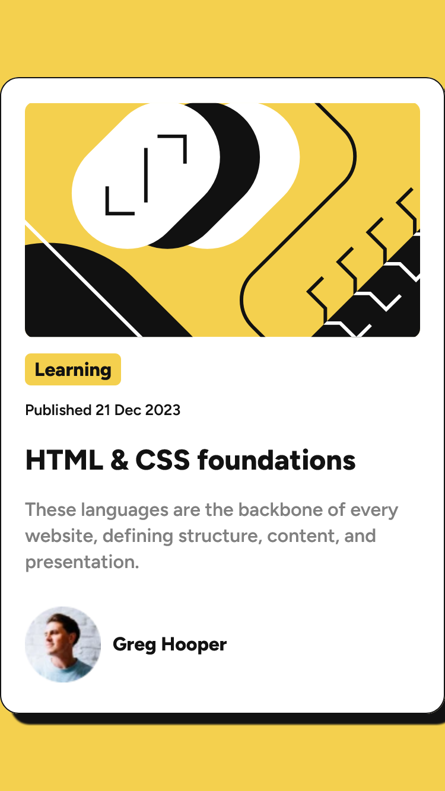
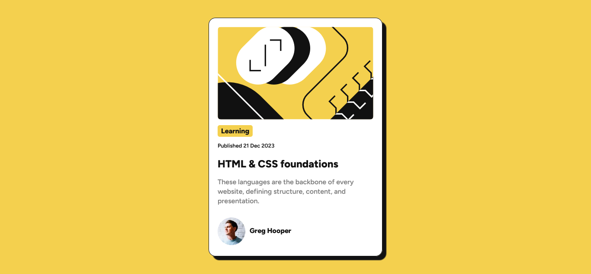

# Blog Preview Card - Solution


Esta es una solución al segundo desafío del reto #100DaysOfProjects. La mejor manera de escribir un buen código es programando todos los días🔥.

## Tabla de contenidos

- [Vision general](#vision-general)
  - [El desafio](#el-desafio)
  - [Capturas](#capturas-de-pantalla)
  - [Enlaces](#enlaces)
- [Proceso de trabajo](#proceso-de-trabajo)
  - [Desarrollo](#desarrollo)
  - [Lo que aprendi](#lo-que-aprendi)
  - [Lo que aprendere](#lo-que-aprendere)
  - [Recursos](#recursos)
- [Autor](#autor)
- [Agradecimientos](#agradecimientos)

## Vision general

### El desafio

Se requiere desarrollar una **tarjeta de blog** con los datos que se muestran en el diseño, usando HTML y CSS.

1. La tarjeta debe incorporar una imagen en la cabecera de la tarjeta.
2. La tarjeta de incluir una sombra (`box-shadow`).
3. La estructura y posición de los elementos debe ser lo más similar al de la imagen.

### Capturas de pantalla




### Enlaces

El proyecto se encuentra alojado en un hosting gratuito(Netlify):

- [Pagina web]()
- [Codigo fuente]()
- [Codepen]()

## Proceso de trabajo

### Desarrollo

- Marcado HTML
- Propiedades CSS
- Flujo de trabajo _mobile-first_

### Lo que aprendi

Aprendimos a usar la [metodologia BEM](https://getbem.com/introduction/), procuramos emplear de la mejor manera.
Este es el marcado HTML con BEM.

```html
<main class="container">
  <article class="card">
    <div class="card__header">
      
    </div>
    <div class="card__body">
      <span>Learning</span>
      <small
        >Published
        <time datetime="21-12-23">21 Dec 2023</time>
      </small>
      <h2 class="card--title">HTML & CSS foundations</h2>
      <p class="card--copy">
        These languages are the backbone of every website, defining structure,
        content, and presentation.
      </p>
    </div>
    <div class="card__footer">
      <div class="card__author">
        
      </div>
      <h4 class="author--name">Greg Hooper</h4>
    </div>
  </article>
</main>
```

Añadimos una tabla de contenidos al archivo styles.css

```css
/* -----------------
Tabla de contenidos:
--------------------
1. Fuente ......................... 11
2. Variables ...................... 15
3. Estilos generales .............. 33
4. Estilos container .............. 47
5. Estilos card ................... 59
6. Estilos header ................. 68
7. Estilos body ................... 78
8. Estilos footer ................. 106
-------------------- */
```

### Lo que aprendere

Aprenderemos más sobre el concepto _mobile-first_ para emplear de la mejor manera al proyecto.

### Recursos

Hemos recopilado una lista de recursos e información valiosa que puede ayudarte a comprender mejor la realización de este hermoso proyecto:

- [BEM Cheat Sheet](https://bem-cheat-sheet.9elements.com/) - Página web con ejemplos e información sobre la metodología BEM.
- [How to Develop and Test a Mobile-First Design in 2021](https://css-tricks.com/how-to-develop-and-test-a-mobile-first-design-in-2021/) - El concepto _mobile-first_

## Autor

Nuestro canales sociales para saber más sobre los contenidos e ideas que compartimos:

- [Facebook](https://www.facebook.com/frontendclubfb)
- [Instagram](https://www.instagram.com/frontendclubig/)
- [LinkedIn](https://www.linkedin.com/in/frontendclub/)
- [Tik Tok](https://www.tiktok.com/@frontendclub)
- [Twitch](https://www.twitch.tv/frontendclub)
- [Blog](https://frontend-club.bullet.site/)

## Agradecimientos

Agradecemos a los miembros de la comunidad Frontend Club, que nos inspiran a seguir creando contenido y compartiendo iniciativas para ayudar a mejorar las habilidades en HTML, CSS, JavaScript y Git.

> “Yo puedo hacer cosas que tú no puedes, tú puedes hacer cosas que yo no puedo; juntos podemos hacer grandes cosas”. — Madre Teresa de Calcuta.
